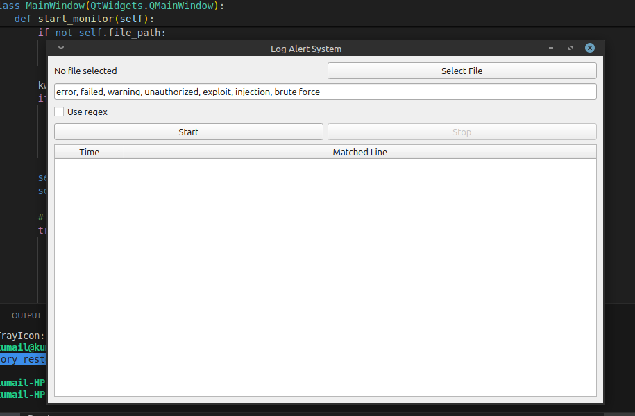
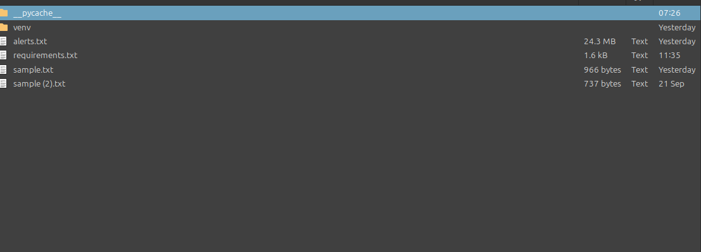
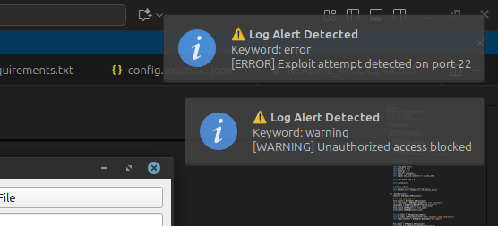

## 🖼️ Screenshots

Here are some previews of the **Log Alert System** in action:

| Screenshot 1 | Screenshot 2 | Screenshot 3 |
|---------------|---------------|---------------|
|  |  |  |

# Log Alert System 🔔📜

A real-time log monitoring and alert system built with **Python** and **PyQt5**. This tool watches log files for specific keywords and generates popup notifications with sound alerts when suspicious or critical events occur.

---

## 🚀 Features

- 📖 **Live Log Monitoring**  
  Continuously reads from a `.log` file and displays the latest lines.

- 🧠 **Keyword Detection**  
  Triggers alerts for predefined keywords like `"unauthorized"`, `"error"`, `"attack"`, etc.

- 🔔 **Beep + Popup Alerts**  
  Plays a beep sound and shows a styled popup message for each detected event.

- 🕒 **Alert History**  
  Stores all triggered alerts in `alerts.txt` for future review.

- ✅ **Simple GUI**  
  Clean PyQt5 interface with alert area and keyword matches.

---

## 📂 Project Structure

log-alert-system/
├── log_alert_gui.py # Main GUI script
├── alerts.txt # Auto-generated alert history
├── sample.txt # Sample log file (you can rename to .log)
├── README.md # This file

---

## 🔧 How to Run

1. **Clone the repo**
   
   git clone https://github.com/kumi125/log-alert-system.git
   cd log-alert-system
Install dependencies

pip install PyQt5
Run the script

python log_alert_gui.py
📌 Make sure sample.txt exists and contains logs, or replace it with your own log file.

⚙️ **Customization**
To change keywords:
Edit the keywords list in log_alert_gui.py.

🛡️ **Use Cases**
Monitoring firewall logs

Detecting intrusion attempts

Server log analysis

Cybersecurity alerting system (for training/demo)

👨‍💻 **Author**
Kumail Hussain
Cybersecurity Student | Islamabad, Pakistan
GitHub: @kumi125

